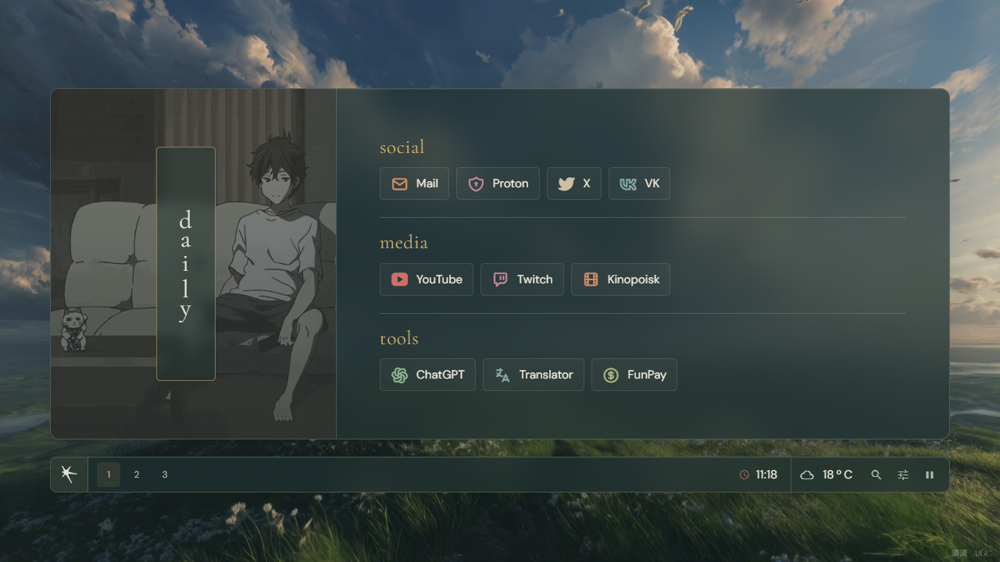
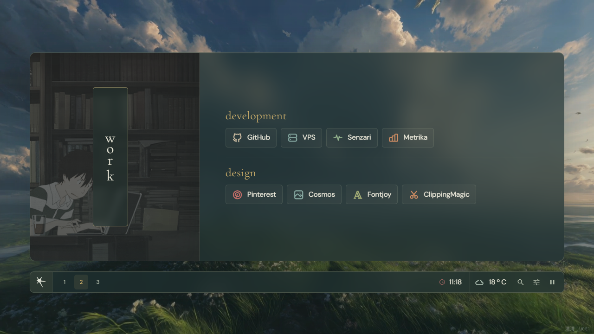
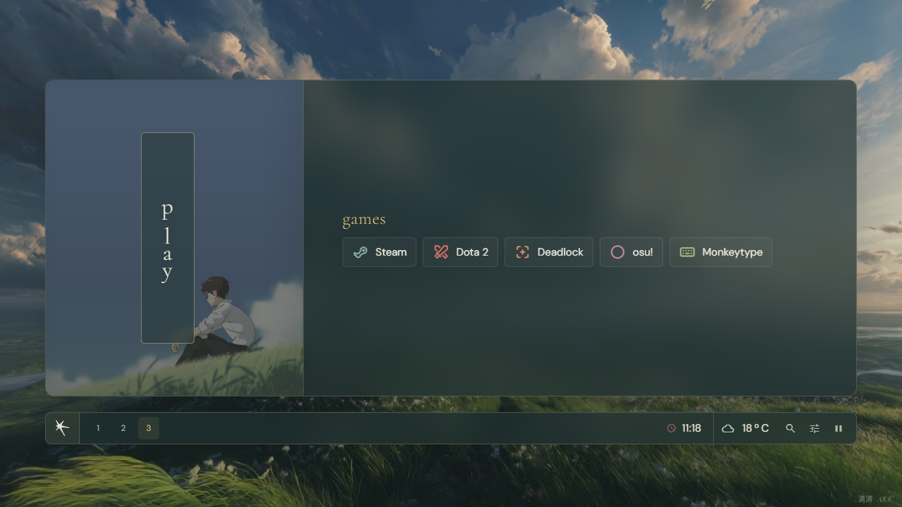
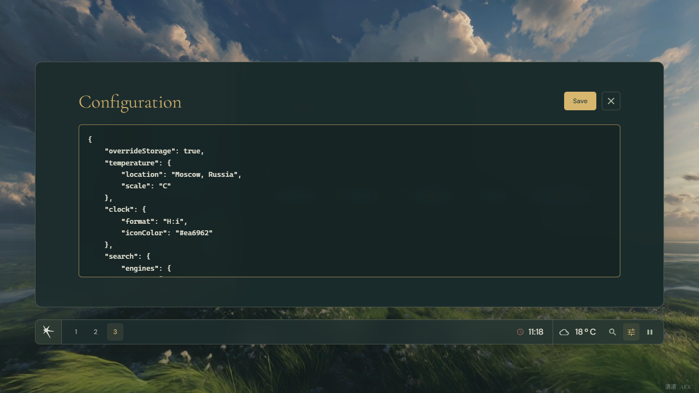
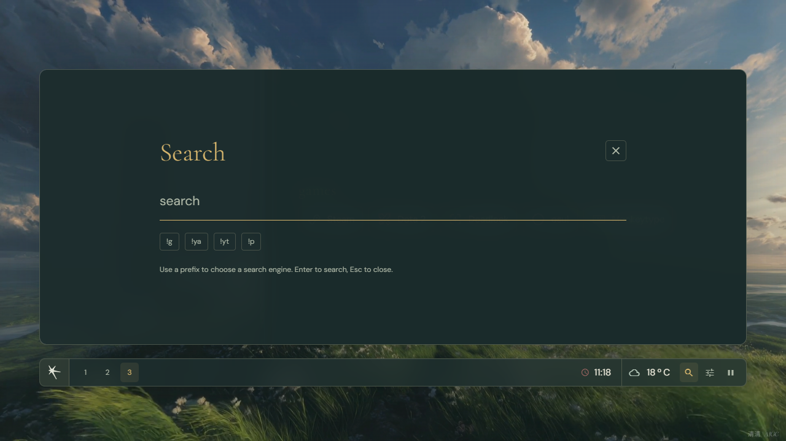

## 💻 Preview

The landscape theme keeps the bookmark panel, animated category banners,
numbered tabs, clock, weather, search, and JSON configuration. Translucent green
glass, warm gold accents, locally hosted fonts, and a looping landscape video
bring the interface together.

| Work tab | Play tab |
| --- | --- |
|  |  |

The silent video background can be paused from the status bar. It pauses when
the page is hidden and uses a still image when reduced motion is enabled.
Wallpaper attribution and usage terms are in [src/media/CREDITS.md](src/media/CREDITS.md).

This start page is based on the [dawn](https://github.com/b-coimbra/dawn) repository, which has even more functionality. I've tweaked the page's style a bit to match my dotfiles, and I've added some features to make it more comfortable.

## ⌨️ Keybindings
| Hotkey                                            | Action                      |
| ------------------------------------------------- | --------------------------- |
| <kbd>Numrow</kbd> \| <kbd>MouseWheel</kbd> \| <kbd>Click</kbd> | Switch tabs            |
| <kbd>s</kbd>                           | Search Dialog            |
| <kbd>Esc</kbd>                           | Close Dialogs            |

## ⚙️ Configuration Dialog

The default configuration file is [userconfig.js](userconfig.js), and you can edit the active configuration in the settings dialog. The page includes category tabs, a clock, weather, search, and a configurable quick link. For details about the original configuration format, see the [dawn repository](https://github.com/b-coimbra/dawn).

Additionally, there are two different new options:
- `fastlink`: The URL opened by the quick-link button.
- `localIcons`: Controls whether the Tabler stylesheet is also added to the document head; the icon files are included in this repository.

## 🔍 Search Dialog

The search dialog allows you to display a search bar with various search engines defined in the configuration. To select each one, you simply need to prefix the query with the corresponding `!<id>`.
By default, the defined search engines are:
- `!g`: google
- `!yt`: youtube
- `!ya`: yandex
- `!p`: pinterest

## Local Icons
The icon fonts and display fonts are bundled in [`src/fonts`](src/fonts). No separate icon-font installation is required.
